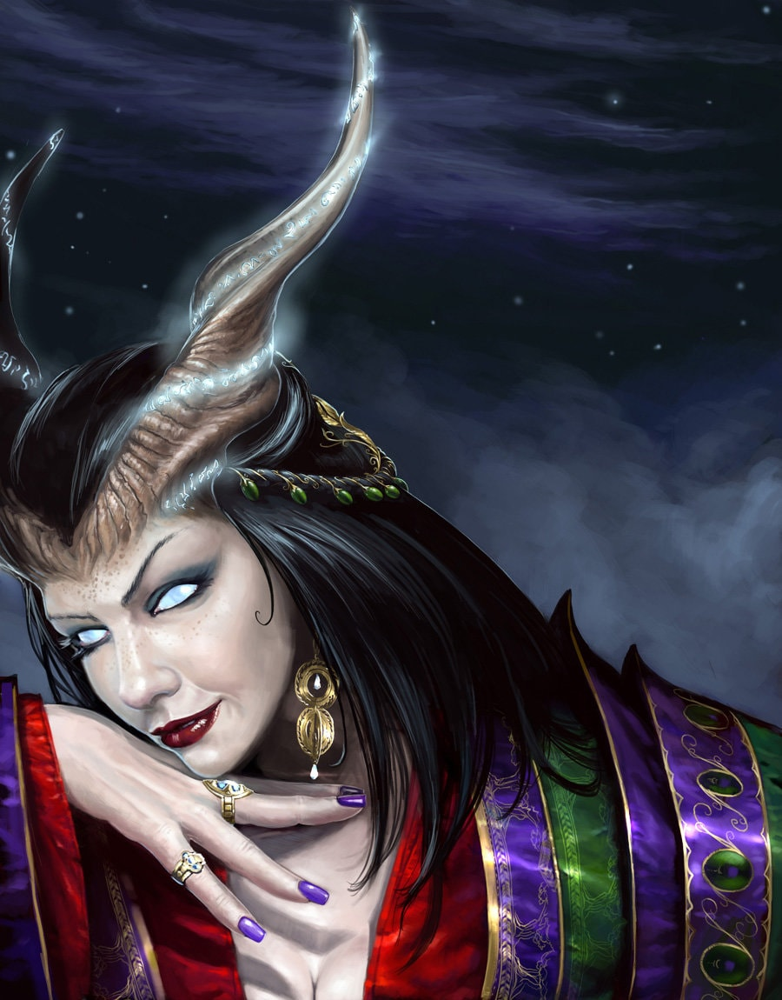
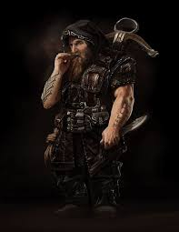
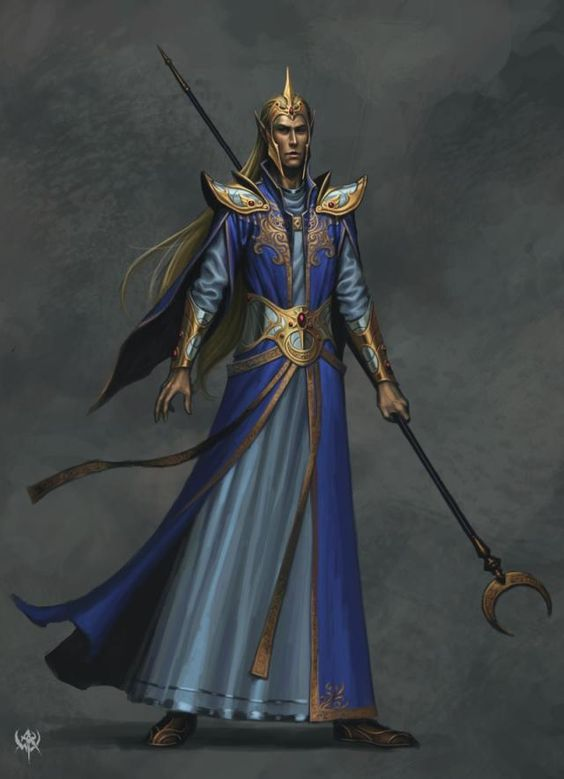
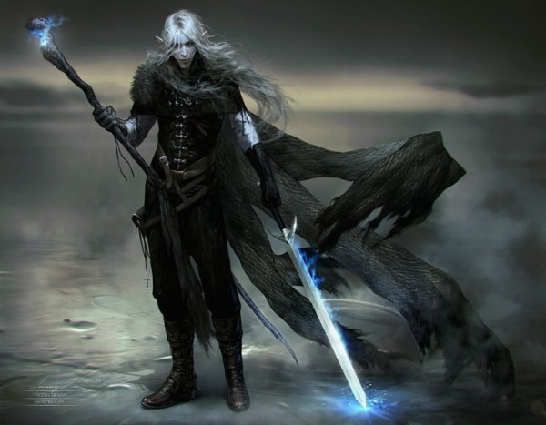
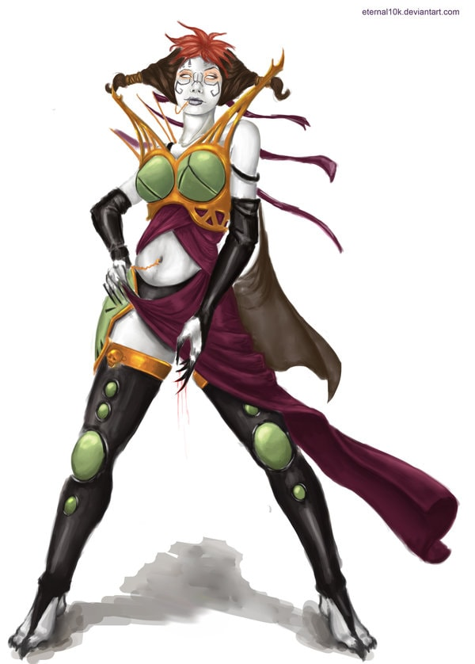
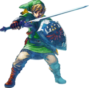
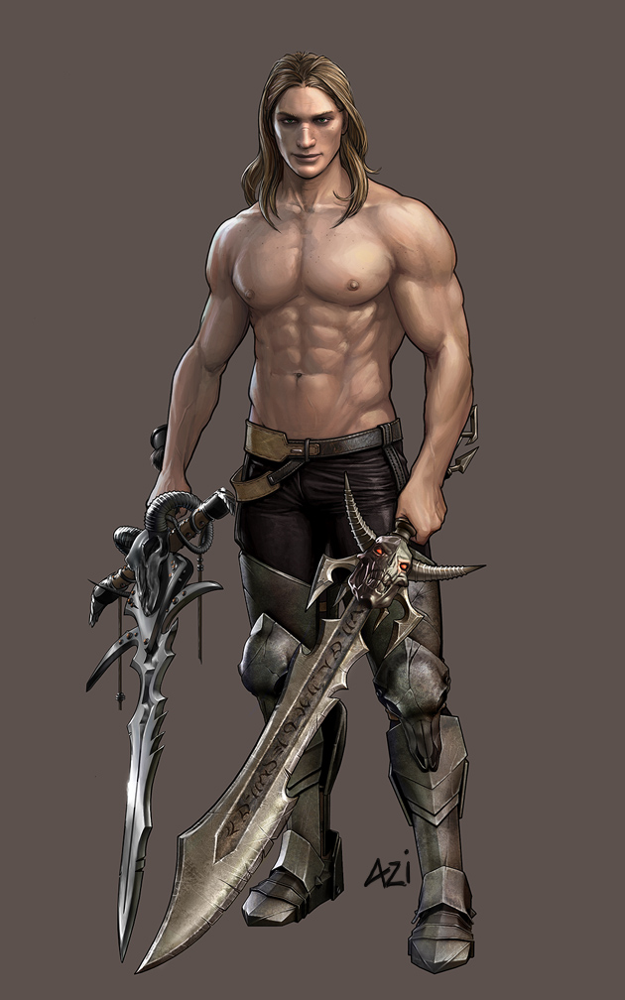
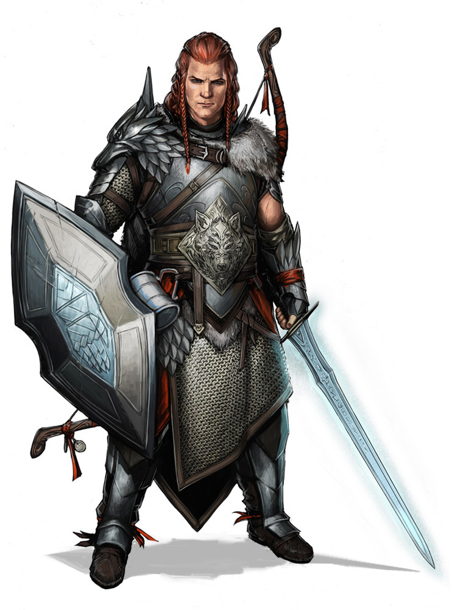

Amusing myself with fantasy, projection, and escapism somewhere between fan fiction and proper pen-and-paper role playing games.

  <ul class="post-list">
   
    <li><article><a href="{{ site.url }}{{ post.url }}">{{ post.title }} <time datetime="{{ post.date | date_to_xmlschema }}">{{ post.date | date: "%B %d, %Y" }}</time> {{ post.excerpt | remove: '\[ ... \]' | remove: '\( ... \)' | markdownify | strip_html | strip_newlines | escape_once }}</a></article></li>
  
  </ul>

  
Cast / Characters

  

  

  

  

  

  

  

  

  <!--
  

  

  

  

  

  -->

